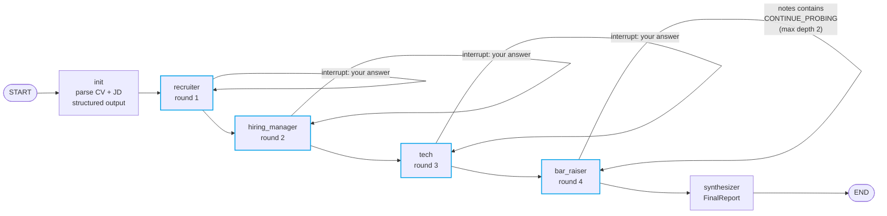

# Architecture

## The graph



## Per-round node shape

Every interviewer node follows the same three-step pattern:

```python
def round_node(state):
    creative = ChatOpenAI(temperature=0.6)
    analytic = ChatOpenAI(temperature=0.1)

    # 1. generate the question with the persona system prompt
    question = creative.invoke([SystemMessage(QUESTION_SYS), HumanMessage(context)]).content

    # 2. hand control to the human and wait
    answer = interrupt({"round": "...", "question": question})

    # 3. score the answer with structured output (Pydantic)
    score = analytic.with_structured_output(RoundScore).invoke(...)

    return {
        "transcript": [{"round": ..., "question": ..., "answer": ...}],  # reducer-merged list
        "round_scores": {..., "<round>": score.model_dump()},
    }
```

Two temperatures matter here:
- **Question generation** uses `temperature=0.6` — we want variety. Two runs of the same CV/JD shouldn't produce identical questions.
- **Scoring** uses `temperature=0.1` — we want a stable, defensible rubric, not creative grading.

## Why LangGraph (not a plain LangChain chain)

| Need                                   | LangGraph capability we use                            |
|----------------------------------------|--------------------------------------------------------|
| Pause mid-flow to wait for the human   | `interrupt(...)` + checkpointer                        |
| Resume from disk hours later           | `SqliteSaver` + thread_id                              |
| Loop on bar_raiser until satisfied     | `add_conditional_edges` self-loop                      |
| Accumulate transcript across nodes     | `Annotated[list, add]` reducer                         |
| Per-session UI state                   | `thread_id` per Gradio session                         |
| Structured rubric output               | `with_structured_output(RoundScore)` (Pydantic)        |

None of this is doable with `RunnableSequence` alone.

## State

```python
class InterviewState(TypedDict, total=False):
    cv_text: str
    jd_text: str
    candidate_profile: dict          # parsed CV
    role_profile: dict               # parsed JD
    transcript: Annotated[list[QA], add]
    round_scores: dict[str, dict]    # round_name -> RoundScore.model_dump()
    bar_raiser_depth: int
    bar_raiser_done: bool
    final_report: dict
```

The `transcript` reducer is `operator.add` so each node returning
`{"transcript": [qa]}` appends rather than overwrites.

## Cost (rough)

A full interview at `gpt-4o-mini`:

| Step                | Tokens (in/out) | Cost      |
|---------------------|-----------------|-----------|
| Parse CV + JD       | ~2k / ~400      | <$0.001   |
| 4 rounds × (Q + score) | ~10k / ~1.5k | ~$0.005   |
| Bar-raiser cycles (avg 1.4) | ~3k / ~500 | ~$0.002 |
| Synthesizer         | ~6k / ~800      | ~$0.002   |
| **Total per interview** |               | **~$0.01** |

You can run a hundred interviews on a single dollar.

## LangSmith tracing

Set `LANGSMITH_TRACING=true` + `LANGSMITH_API_KEY` and every run gets a trace
URL. Each node call (question generation, scoring, synthesizer) appears as a
separate run inside the parent thread. This is the screenshot you want to drop
into your README — it's the strongest single signal that you understand
production LLM observability.
